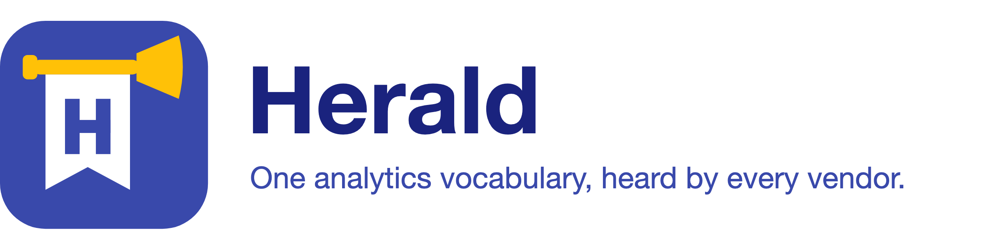

<picture>
  <source media="(prefers-color-scheme: dark)" srcset="docs/assets/readme-banner-dark.png">
  
</picture>

> *A herald announces an event to whoever is listening.*

[](https://central.sonatype.com/namespace/io.github.mkhytarmkhoian)
[](https://github.com/MkhytarMkhoian/herald/actions/workflows/ci.yml)
[](LICENSE)
[](https://mkhytarmkhoian.github.io/herald/)

Herald is an analytics library for mobile apps. Your app describes what happened as an event, and
Herald sends that event to every analytics service you use: Firebase, Adjust, Mixpanel, AppsFlyer,
Amplitude, or one you build yourself.

See the [project website](https://mkhytarmkhoian.github.io/herald/) for documentation and APIs.

This repository is the **Android SDK**. The Flutter SDK is in development.

- **Your features don't know which vendors you use.** A feature tracks its own event, like
  `CheckoutStarted`, and never calls a vendor SDK directly. You can add, replace or remove a vendor
  without touching feature code.
- **Each vendor gets data the way it expects.** GA4 wants screen views as `screen_view`, Adjust
  only takes events you created a token for, and AppsFlyer counts money only as `af_revenue`. You
  describe these rules once per vendor, instead of spreading them across the app.
- **It fits apps split into feature modules.** Each feature module keeps its own events and
  decides how they reach each vendor. The app module only chooses the vendors, so a new feature
  doesn't mean editing a shared file.
- **One broken vendor can't break the rest.** If a vendor SDK throws, Herald reports the error and
  keeps sending to the others.
- **Easy to test.** Your classes depend on a small interface, not a vendor SDK, and a fake records
  every event in tests.

## Install

```kotlin
dependencies {
    implementation("io.github.mkhytarmkhoian:herald-core:1.1.0")
    implementation("io.github.mkhytarmkhoian:herald-firebase:1.1.0") // one per vendor you use
    testImplementation("io.github.mkhytarmkhoian:herald-testing:1.1.0")
}
```

All modules share one version. Each vendor module pulls in `herald-core` and that vendor's SDK for
you.

## In 30 seconds

An event is a type your app owns:

```kotlin
data class CheckoutStarted(val plan: String, val seats: Int) : Event {
    override val name = "checkout_started"
    override val parameters = parameters {
        put("plan", plan)
        put("seats", seats)   // stays a number all the way to the vendor
    }
}
```

A class tracks it through `EventTrackerService`, a small interface. It doesn't know which vendors
exist:

```kotlin
class CheckoutViewModel(private val analytics: EventTrackerService) : ViewModel() {
    fun onCheckout(plan: String, seats: Int) = viewModelScope.launch {
        analytics.track(CheckoutStarted(plan, seats))
    }
}
```

At app start-up, you build one `Herald` with your vendors and give it to your classes as
`EventTrackerService`:

```kotlin
val herald = Herald {
    provider(name = "firebase", events = firebaseTracker, properties = firebaseTracker)
    provider(name = "adjust", events = adjustTracker)
    errorReporter { provider, operation, failure -> crashlytics.recordException(failure) }
}
```

## Modules

| Module | What it is |
| --- | --- |
| `herald-core` | Events, properties and `Herald` itself. Plain Kotlin, with no Android, vendor SDK or DI library. |
| `herald-firebase` | Sends to Firebase Analytics (GA4). |
| `herald-adjust` | Sends to Adjust: events by dashboard token, purchases and ad revenue. |
| `herald-mixpanel` | Sends to Mixpanel: events, user profile and super properties. |
| `herald-appsflyer` | Sends to AppsFlyer: conversions, purchases, subscriptions and ad revenue. |
| `herald-amplitude` | Sends to Amplitude: events, user properties, screen views and revenue. |
| `herald-log` | Prints every call to Logcat, for debug builds. |
| `herald-compose` | Helpers to track screen views, clicks and impressions from Compose. |
| `herald-testing` | `FakeAnalyticsProvider`, a fake vendor that records events so your tests can check them. |

## Documentation

The full documentation is at **[mkhytarmkhoian.github.io/herald](https://mkhytarmkhoian.github.io/herald/)**:

- [Android SDK](https://mkhytarmkhoian.github.io/herald/sdks/android/): install, modules and
  supported versions.
- [Getting started](https://mkhytarmkhoian.github.io/herald/getting-started/quick-start/): send
  your first event, then set Herald up for a real app.
- [Philosophy](https://mkhytarmkhoian.github.io/herald/philosophy/): why Herald works the way it
  does.
- [Guides](https://mkhytarmkhoian.github.io/herald/guides/routing/): routing, feature modules,
  consent, identity, revenue and testing.
- [Vendors](https://mkhytarmkhoian.github.io/herald/vendors/firebase/): what each vendor receives,
  and what to watch out for.
- [API reference](https://mkhytarmkhoian.github.io/herald/api/android/).

[Moove](https://github.com/MkhytarMkhoian/Moove) is a sample app that uses every module, including
feature modules, consent, sign-in, Compose and a screen that shows every event it sent.

See [CHANGELOG.md](CHANGELOG.md) for release notes and [CONTRIBUTING.md](CONTRIBUTING.md) to
contribute.

## License

    Copyright 2026 Mkhytar Mkhoian

    Licensed under the Apache License, Version 2.0 (the "License");
    you may not use this file except in compliance with the License.
    You may obtain a copy of the License at

       https://www.apache.org/licenses/LICENSE-2.0

    Unless required by applicable law or agreed to in writing, software
    distributed under the License is distributed on an "AS IS" BASIS,
    WITHOUT WARRANTIES OR CONDITIONS OF ANY KIND, either express or implied.
    See the License for the specific language governing permissions and
    limitations under the License.
